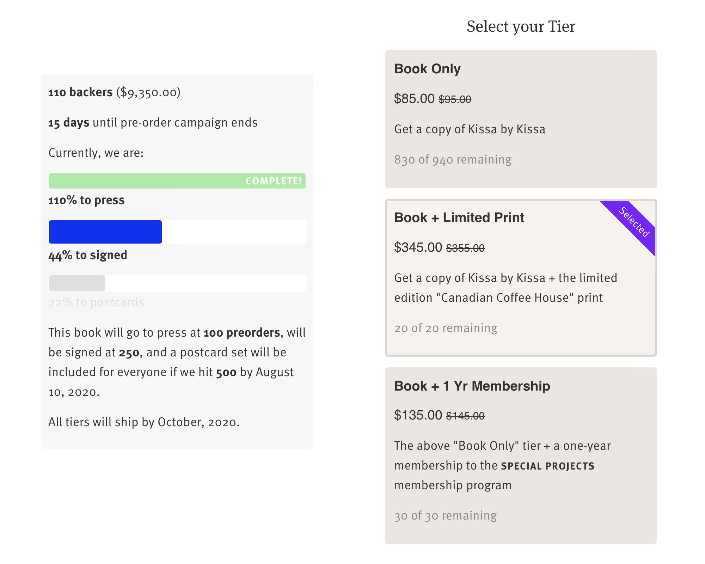

# SP-starter

A free to use / edit / extend crowdfunding tool for Shopify with multiple goals and variants as campaign tiers. 

By [Craig Mod](https://craigmod.com). 
Made possible by [SPECIAL PROJECTS](https://craigmod.com/membership/). 
Released under Mozilla Public License 2.0. 

### Why?

Crowdfunding campaigns are great ways to "activate" communities. Shared goals and a sense of "unlocking" a creative project help incentivize consolidated and immediate action. 

Kickstarter is an excellent way to run a crowdfunding campaign. But if you already have a community built up, and have communication channels in place (via a newsletter, for example), and already run an online shop, then Kickstarter can be unnecessarily cumbersome. Kickstarter's 10% fee is also quite hefty. By leaning on Shopify's flexible Liquid templating system and reasonable CC processing fees, an independent publisher running a campaign can save some ~$7,000 for every $100,000 of sales by using SP-starter instead of Kickstarter. That's materially meaningful, especially in the world of books. 

### Advantages and disadvantages 
The goal of SP-starter is to provide a straightforward way for folks to run crowdfunding campaigns on their Shopify shop without having to pay a monthly fee for metafield editing plugins or other crowdfunding plugins. 

SP-starter offers the following benefits over Kickstarter:

- free to use / modify
- only pay Shopify's payments fee (~2.8%) instead of Kickstarter's fee (~10%)
- multiple goals — you don't have to resort to "stretch goals" without progress indicators 
- total customization of design
- completed campaigns live on your website, not Kickstarter's

Kickstarter is better than SP-starter in many ways, not the least of which are:

- The Kickstarter ecosystem offers network / community effects around PR and amplification of campaign 
- Simpler to setup (i.e., no setup; Kickstarter hosts and runs your campaign)
- Kickstarter payments only happen when main campaign goal is reached; SP-starter charges immediately
- Kickstarter has tools for following up / providing campaign updates / community communication 

The lack of goal-triggered payments is probably the biggest "downside" to SP-starter. Technically, I believe you can have charges be authorized on checkout, but only pushed through on "shipping" — allowing one to approximate the Kickstarter experience on Shopify. However, these charge authorizations are short lived, and this would only for (as far as I can tell) for quick campaigns. 

That said, many Kickstarter campaigns are run as promotional tools more than strict fundraising tools, with the intent by creators to ship no matter what. In theory, one could set a minimum goal on Shopify which, if not met, would trigger a manual refunding of all backers (minus the ~2.8% processing fees). Robin Sloan rigged up something similar with his [2020 Sloanstarter campaign](https://www.robinsloan.com/sloanstarter/). 

In the end, if you have an audience, and you have reasonable baseline goals, then the issue of "raising enough funds" for a project launch is often not an issue. 

----

## Installing

Note: The included `snippets/product-template.liquid` file is based off the "Simple" Shopify theme. You'll have to modify your own `product-template.liquid` file if you're using a different theme. 

I've tried to make this as simple as possible to install / setup without it being a plugin (hence affording you the most flexibility / necessary modifications). 

1. Place `camapign.liquid` into your template `snippets` folder. 
2. Place `campaign.scss` into your template `assets` folder.
3. Add `{{ 'campaign.scss.css' | asset_url | stylesheet_tag }}` between the `<head> </head>` tags in `theme.liquid`.
4. Either backup your `product-template.liquid` file and replace with the included `sections/product-template.liquid` or copy over the relevant `campaign`-related sections to your own template. 

The campaign sidebar is rendered using the following line in product-template: 
``

----

### Variables / Metafields
All variables used by the SP-starter snippet to run a campaign are set using a combination of product and variant-specific metafields. 

#### Product Metafields

`fundingcampaign:` TRUE = running campaign; campaign code will not execute unless this is set to true

`campaignenddate:` when the campaign ends in format of : 
  YEAR-MO-DA HR:MN, i.e., 2020-08-15 22:30

`totalavailableproducts:` how many total products you're selling (all variants inclusive)

`goalamounts:` defines # of goals and sales amount per goal in comma-separated format: 
 NUM, NUM, NUM, i.e., 100, 250, 500

`goaltext:` the text appearing with each goal, for each goal amount in comma-separated format: 
 TEXT, TEXT, TEXT, i.d., to print, to signed, to postcards

`campaigninfo:` text blob appearing below goals, can contain html, et cetera

#### Variants Metafields

`variantdescription:` The extended description appearing in the selection box

`totalquantity:` Total number of available items for this variant; 
  sales calculated based on totalquanity - remaining inventory 

----

Shopify sneakily provides a way to easily edit metafields without a plugin using the following url structure. Change the YOURSHOP part of the url to your own shop url snippet, and these URLs should load up Shopify's own Metafields editor with the appropriate fields ready to be filled in. 

Save these URLs as bookmarks to edit / modify as needed. 

#### For products: 

`https://YOURSHOP.myshopify.com/admin/bulk?resource_name=Product&edit=metafields.global.fundingcampaign,metafields.global.campaignenddate,metafields.global.totalavailableproducts,metafields.global.goalamounts,metafields.global.goaltext,metafields.global.campaigninfo`

#### For variants: 

`https://YOURSHOP.myshopify.com/admin/bulk?resource_name=ProductVariant&edit=metafields.global.variantdescription,metafields.global.totalquantity
`

----

## Screenshots

----

## Todo

- Setup monetary goals (right now it's just unit sales to keep it simple)
- Clean up javascript to be more elegant
