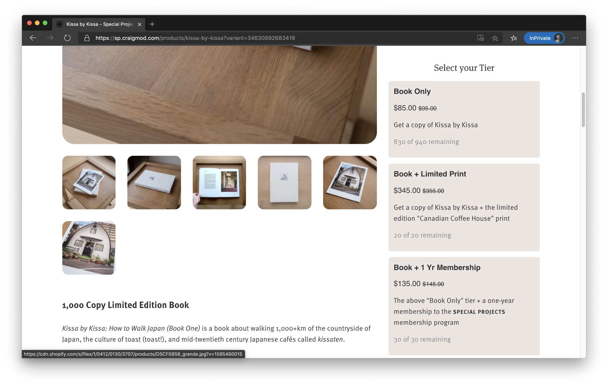

# Craigstarter

An indie Kickstarter-like experience for Shopify with multiple goals and variants as campaign tiers. 

By [Craig Mod](https://craigmod.com). Made available under Mozilla Public License 2.0. 

The goal of this is to provide a fairly easy way for folks to run crowdfunding campaigns on their Shopify shop without having to pay a monthly fee for metafield editing plugins or other crowdfunding plugins. 

Craigstarter offers the following benefits over Kickstarter:

- free to use / modify
- only pay Shopify's payments fee (~2.8%) instead of Kickstarter's fee (~10%)
- multiple goals — you don't have to resort of "stretch goals" without progress indicators 
- total customization of design

Kickstarter is better than Craigstarter in the following ways:

- The Kickstarter ecosystem offers network / community effects around PR and amplification of campaign 
- Simpler to setup (i.e., no setup; Kickstarter hosts and runs your campaign)
- Kickstarter payments only happen when main campaign goal is reached; Craigstarter charges immediately
- Kickstarter has tools for following up / providing campaign updates / community communication 

----

## Goals and Tiers Screenshots

## Installing

Note: The included `product-template.liquid` file is based off the "Simple" Shopify theme. You'll have to modify the template if you're using a different theme. 

I've tried to make this as simple as possible to install / setup without it being a plugin (hence affording you the most flexibility / necessary modifications). 

1. Place `camapign.liquid` into your template `snippets` folder. 
2. Place `campaign.scss` into your template `assets` folder.
3. Add `{{ 'campaign.scss.css' | asset_url | stylesheet_tag }}` between the `<head> </head>` tags in `theme.liquid`.
4. Either backup your `product-template.liquid` file and replace with the included `sections/product-template.liquid` or copy over the relevant `campaign`-related sections to your own template. 

The campaign sidebar is rendered using the following line in product-template: 
``

----

### Variables / Metafields
All variables used by the Craigstarter snippet to run a campaign are set using product / variant metafields. 

#### For products

`fundingcampaign:` TRUE = running campaign 

`campaignenddate:` when the campaign ends in format of : 
  YEAR-MO-DA HR:MN, i.e., 2020-08-15 22:30

`totalavailableproducts:` how many total products you're selling (all variants inclusive)

`goalamounts:` defines # of goals and sales amount per goal in comma-separated format: 
 NUM, NUM, NUM, i.e., 100, 250, 500

`goaltext:` the text appearing with each goal, for each goal amount in comma-separated format: 
 TEXT, TEXT, TEXT, i.d., to print, to signed, to postcards

`campaigninfo:` text blob appearing below goals, can contain html, et cetera

#### For variants

`variantdescription:` The extended description appearing in the selection box
`totalquantity:` Total number of available items for this variant; 
  sales calculated based on totalquanity - remaining inventory 

----

Shopify sneakily provides a way to easily edit metafields without a plugin using the following url structure: 

#### For products: 

`https://YOURSHOP.myshopify.com/admin/bulk?resource_name=Product&edit=metafields.global.fundingcampaign,metafields.global.campaignenddate,metafields.global.totalavailableproducts,metafields.global.goalamounts,metafields.global.goaltext,metafields.global.campaigninfo`

#### For variants: 

`https://YOURSHOP.myshopify.com/admin/bulk?resource_name=ProductVariant&edit=metafields.global.variantdescription,metafields.global.totalquantity
`

----

## Screenshots

